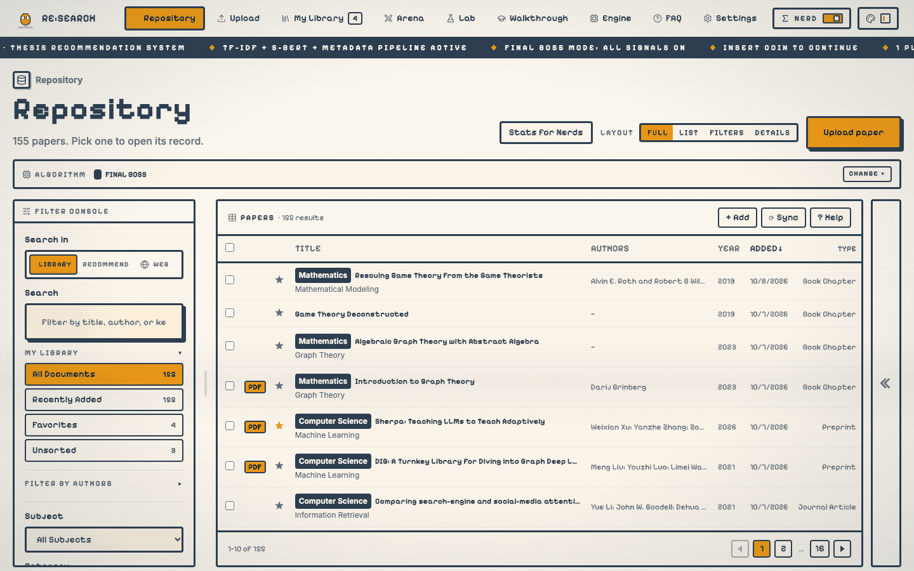
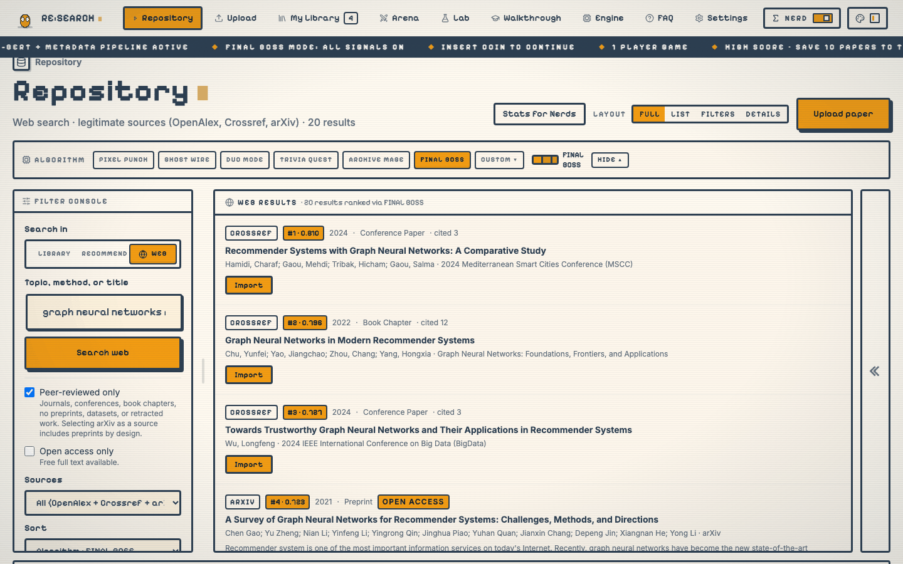
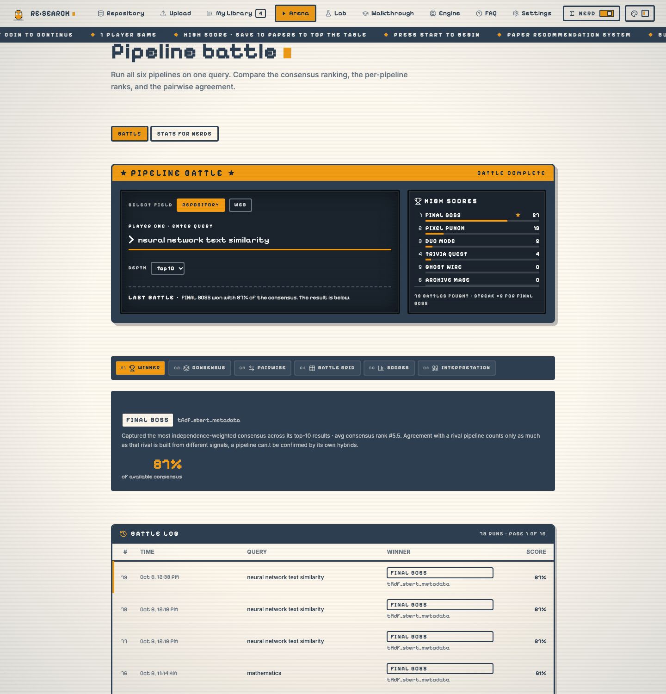
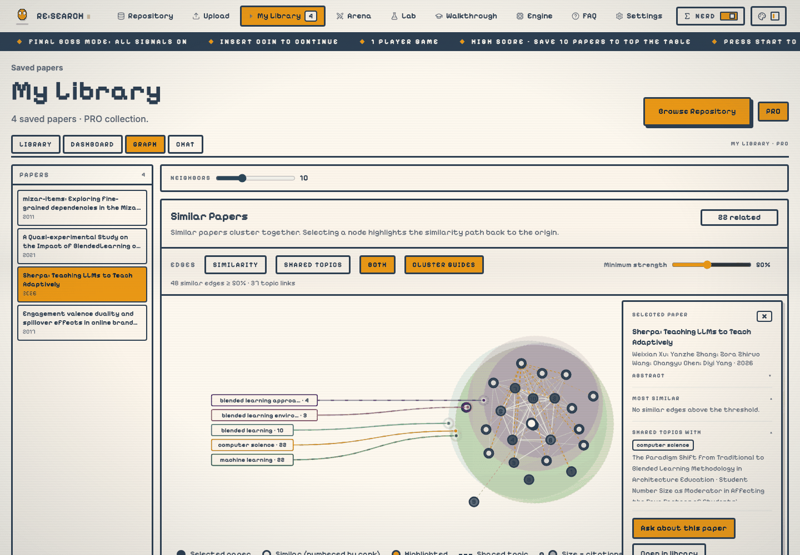
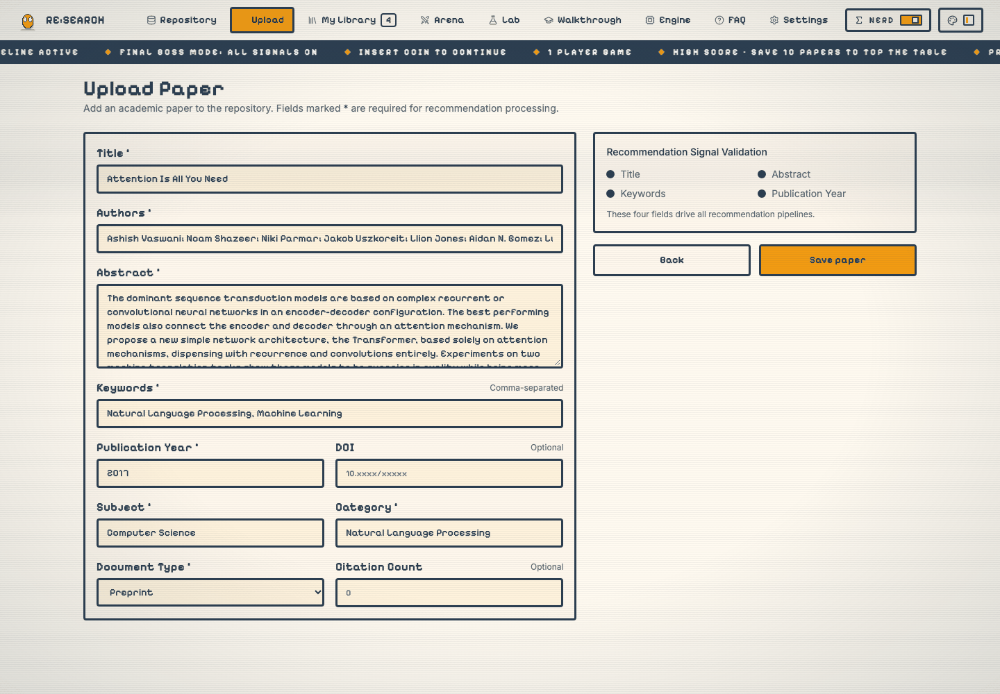
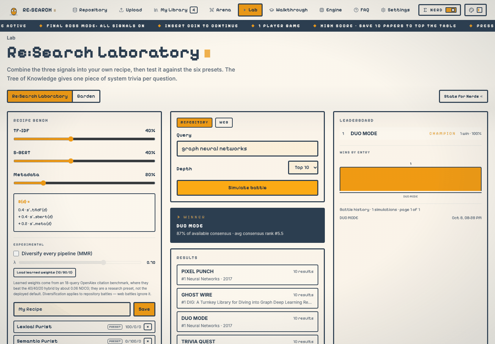
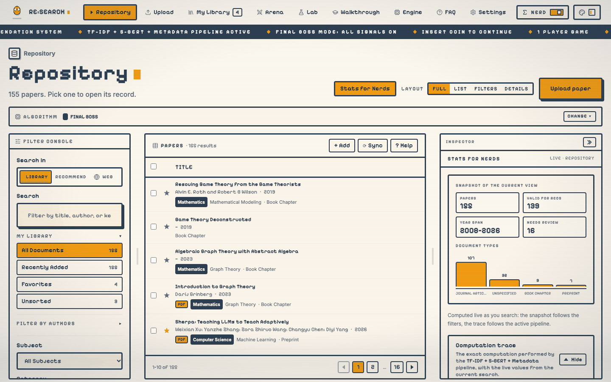

# Re:Search

**A hybrid academic-paper recommender for thesis writing**, built at Bulacan State University (BSMCS).

Re:Search keeps a local repository of papers, ranks related literature with three signals (lexical, semantic and metadata), and lets you compare six ways of combining them side by side. It runs entirely on your own machine: a FastAPI + SQLite backend and a React + TypeScript frontend.

<p align="center">
  
</p>

> **Status:** a local research prototype. It is built to be explored and measured, not deployed.

---

## Main page

| | |
| --- | --- |
| **Find** | Search your own papers, rank them against a query or a seed paper, or rank the open scholarly web (OpenAlex, Crossref, arXiv) with the same algorithms. |
| **Add** | Drop PDFs, BibTeX, RIS or EndNote files, paste DOIs and arXiv ids, or send a Google Scholar citation. Everything is checked before it is saved. |
| **Compare** | The Arena runs all six pipelines on one query and tells you where they agree, where they split and which one wins. |
| **Keep** | A personal library with a dashboard, a similarity graph and a research chat that cites its sources. |
| **Explore** | A recipe bench for designing your own weights, and a few playful extras we'd rather you discover than read about. |

---

## A look around

<table>
  <tr>
    <td width="33%"><br><b>Recommend</b><br>Pick an algorithm and the results re-rank at once, on your papers or on the web.</td>
    <td width="33%"><br><b>Arena</b><br>Six pipelines, one query: consensus, pairwise agreement and a winner.</td>
    <td width="33%"><br><b>My Library</b><br>See how your papers cluster, then ask questions across them.</td>
  </tr>
  <tr>
    <td><br><b>Upload</b><br>Review what was extracted, fix it, and see a duplicate warning before you save.</td>
    <td><br><b>Lab</b><br>Mix the three signals into your own recipe and test it against the presets.</td>
    <td><br><b>Stats for Nerds</b><br>The exact numbers behind any ranking, live as you search.</td>
  </tr>
</table>

---

## How it ranks

Each paper is turned into a prepared text (title, abstract and keywords) and scored three ways:

| Signal | What it measures |
| --- | --- |
| **TF-IDF** | Shared vocabulary: how much a query and a paper use the same, distinctive words. |
| **S-BERT** | Shared meaning: embeddings from `all-MiniLM-L6-v2`, so a paraphrase still matches. |
| **Metadata** | Title, abstract, keywords and publication year, weighted equally. |

Six fixed pipelines combine them (each alone, three pairs, and all three together), and a seventh, *custom*, takes your own weights. The scores are normalized, fused, and ties are broken by year and then title, so the same input always gives the same ranking. The mathematics, with a worked example, is in the wiki's **Engine** manual.

---

## The wiki

Re:Search documents itself. Once it is running, open the app and go to:

| Where | What is inside |
| --- | --- |
| **Walkthrough** (`/walkthrough`) | Every page and feature, with screenshots, laid out like a wiki: a page for each part of the application. |
| **Engine** (`/walkthrough-engine`) | Every formula the system computes, the similar-papers graph, how the Arena votes, and a worked example you can follow by hand. |

There is a search box, a contents rail and full-screen figures. We kept the surprises out of this README on purpose.

---

## Three ways to see it

| Mode | For |
| --- | --- |
| **Library** | Visitors: a calm "smarter librarian" with only the features the library staff enable. |
| **Researcher** | The full tool, every control switched on. |
| **Presentation** | The version that ships: no developer controls, the study's own features, formal names throughout. |

Switch in **Settings**. (Presentation can be left again with a key combination and a password; the wiki says how.)

---

## Quick start

You need **Python 3.10+** and **Node.js 18+**. The first run downloads the S-BERT model, so it needs internet once.

```bash
# 1. Backend  (from the project root)
python -m venv .venv
source .venv/bin/activate            # Windows: .venv\Scripts\Activate.ps1
pip install -r requirements.txt
python -m scripts.rebuild_recommendation   # build the TF-IDF and S-BERT index
uvicorn app.api:app --reload --port 8000

# 2. Frontend  (in a second terminal)
cd frontend
npm install
npm run dev                           # http://localhost:5173
```

Sign in with any email and password: it is a single-user local app. For the research chat, copy `.env.example` to `.env` and add a `GROQ_API_KEY` (optional; everything else works without it). The longer, step-by-step version, with prerequisites and troubleshooting, is in [`docs/SETUP.md`](docs/SETUP.md).

---

## Under the hood

| Layer | Built with |
| --- | --- |
| Backend | FastAPI, SQLAlchemy, SQLite |
| Text and models | scikit-learn (TF-IDF), sentence-transformers (S-BERT), pdfplumber, YAKE |
| Sources | OpenAlex, Crossref, arXiv, Unpaywall, Semantic Scholar (public APIs, no scraping) |
| Frontend | React 18, TypeScript, Vite, Tailwind CSS |

```text
app/            FastAPI app, models, and the services behind every feature
  services/recommendation/   the three signals, fusion, the Arena's comparison
frontend/       the React app (pages, components, the wiki)
scripts/        maintenance and evaluation scripts (rebuild the index, bulk upload, ...)
test/           backend tests
research-scholar-extension/  an optional Chrome extension for Google Scholar
thesis-paper/   the thesis chapters, appendices and LaTeX
docs/           the setup guide
```

---

## Tests

```bash
python -m unittest discover -s test          # backend
cd frontend && npm run test:units            # frontend logic
cd frontend && npm run check                 # type-check
```

---

## Good to know

- **Scope.** One machine, one SQLite file, text-based signals only. There is no collaborative filtering and no user profiling; scanned PDFs are not OCR'd, so extraction from them is rough. The thesis lists the delimitations in full.
- **Your data stays local.** Web lookups only ask public scholarly APIs; nothing is uploaded anywhere. Saving a web result copies its metadata into your own database.
- **Rebuild after big changes.** The index goes stale when the repository changes; the app says so and offers a rebuild button.

---

*Re:Search · BulSU BSMCS thesis project.*
