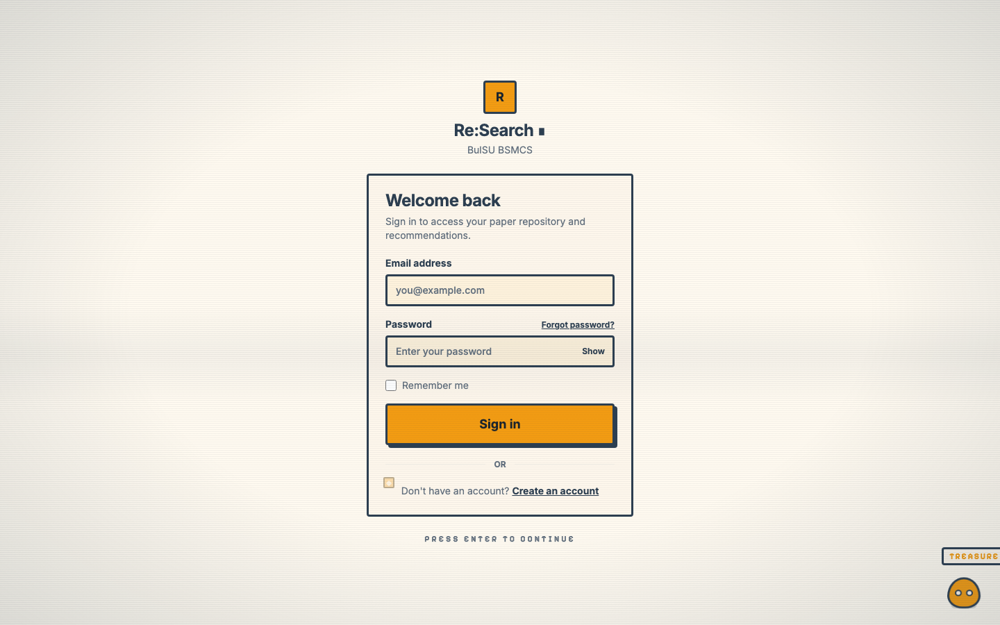
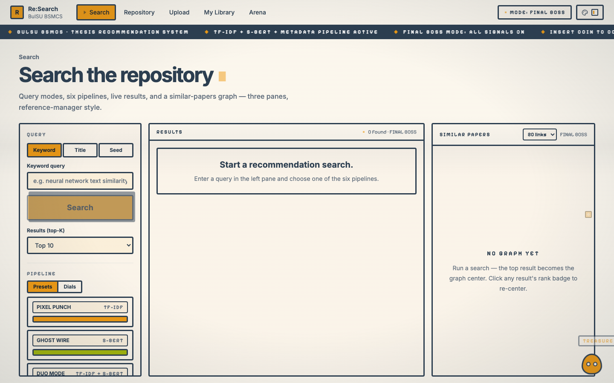
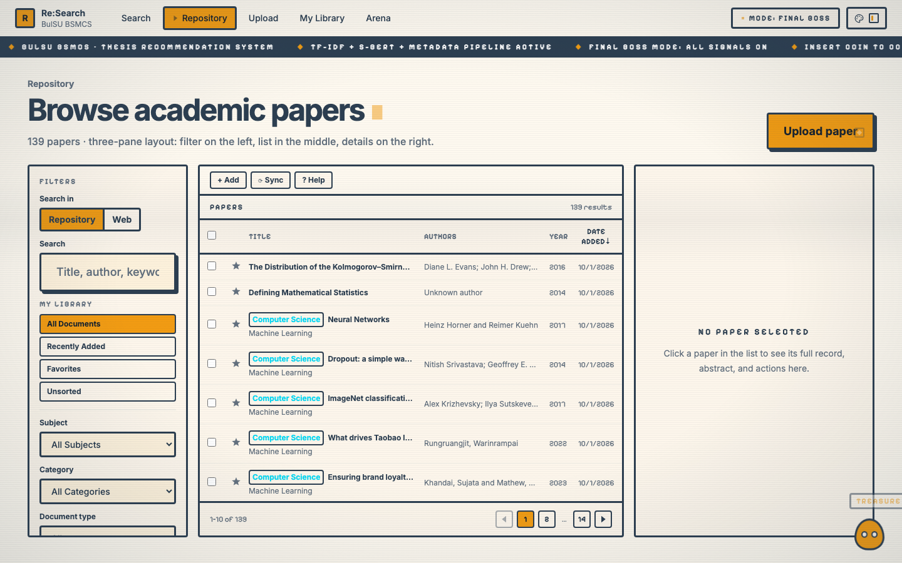
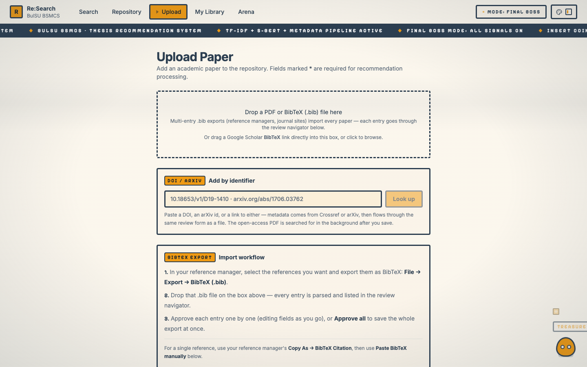
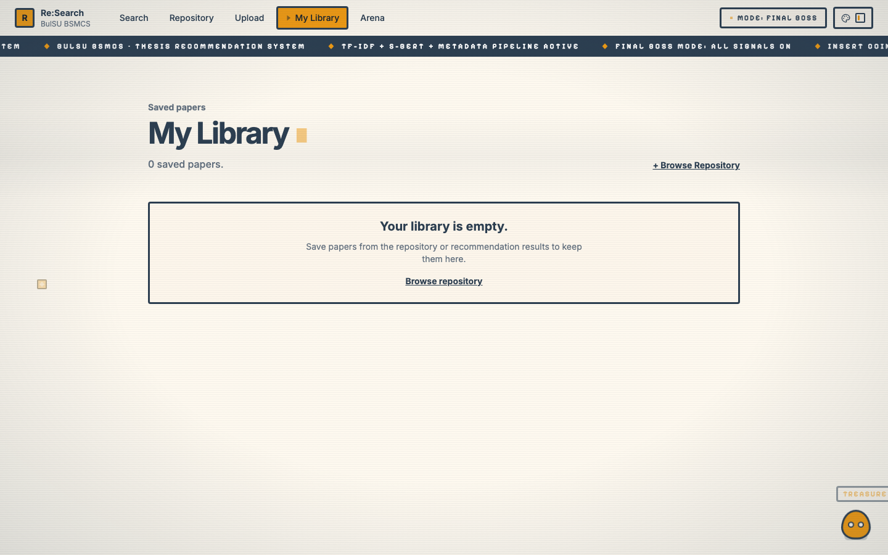
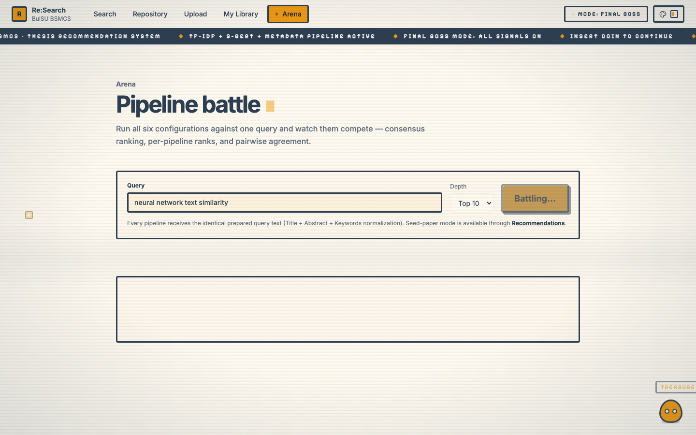
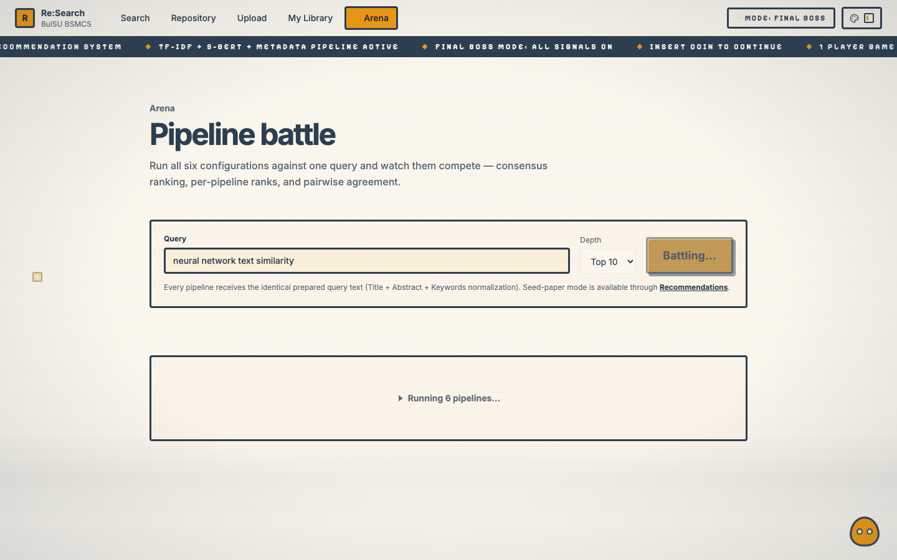

# APPENDIX A

## SCREENSHOTS OF THE SYSTEM

This appendix presents screenshots of the Re:Search prototype, the academic paper repository and recommendation system developed in this study. Each figure corresponds to a page exercised by the study's evaluation workflow: importing papers, rebuilding the recommendation index, running the six recommendation pipelines, and comparing them in the Arena. Screenshots were captured from the running development build (Vite frontend against the local FastAPI backend) at a 1440 × 900 viewport.

Figure A-1

Login page

Figure A-2

Recommendations page

Figure A-3

Repository page

Figure A-4

Upload page

Figure A-5

My Library page

Figure A-6

Arena page — pipeline battle results

Figure A-7

Arena page — battle records

